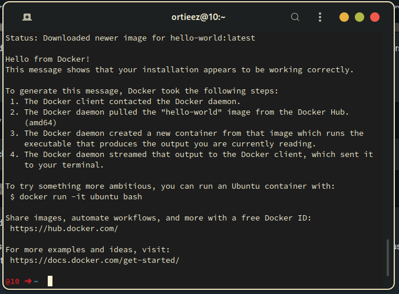
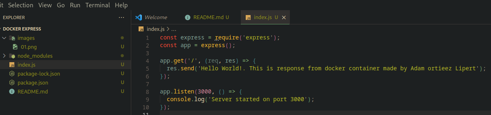
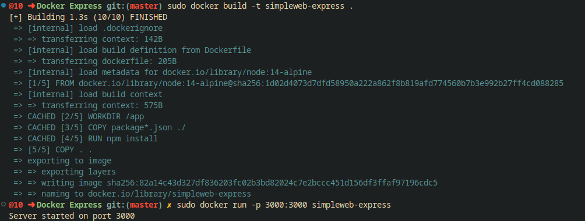
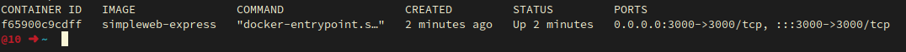

# Hello World with Express.js and Node.js

- This is a step-by-step guide to create a "Hello World" application with Express.js and Node.js, and then create a Docker image for it.

## Prerequisites

- Node.js installed on your machine
- Basic knowledge of JavaScript and terminal commands
- Docker installed on your machine

## Steps

1. Create a new directory and initialize a Node.js project
2. Install Express.js and create a simple server
3. Test the server
4. Create a Dockerfile
5. Build the Docker image
6. Run the Docker container

- Index.js file

- Image of built dockerfile and running docker container

- Image of running docker container in list (docker ps)

